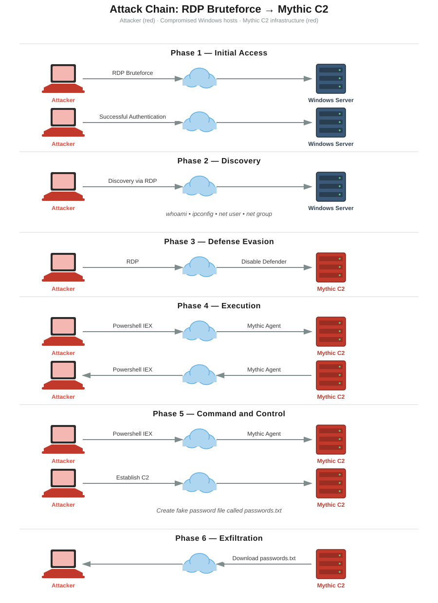

# purple-team-lab
## Overview
A SOC environment built over 4 weeks, covering:
- How to draw a logical diagram
- How to setup and configure ELK
- How to attack, detect and investigate
- How to create alerts and dashboards
## Architecture


**Components (from the architecture diagram):**
- SOC Analyst Laptop — connects to Elastic via web GUI
- Attack Laptop (Kali Linux) — connects over the internet
- C2 Server using Mythic
- Vultr VPC — private network
  - Elastic and Kibana server
  - OSticket server (receives alerts/tickets from Elastic)
  - Fleetserver (manages agents)
  - Windows Server (RDP enabled) — forwards logs via agent, managed by Fleetserver
  - Ubuntu Server (SSH enabled) — forwards logs via agent, managed by Fleetserver
## Attack Diagram

## Build log
### Week 1
- Introduction to ELK
- How to setup ELK
- Ingesting logs such as Sysmon
### Week 2
- Introduction to brute force attacks
- How to setup SSH and RDP servers
- Create alerts and dashboards
### Week 3
- Introduction to command and control
- How to setup your own C2 server (Mythic)
- Attack our public servers
### Week 4
- Introduction to ticketing system
- How to setup and integrate ticketing system
- Go over how to investigate alerts (high-level)
## Troubleshooting notes
Issues encountered and resolved while setting up Kibana:
- **Kibana wouldn't start (`EADDRNOTAVAIL`)** — `kibana.yml` had `server.host` set to a specific IP that no longer matched the VM's actual DHCP-assigned IP. Fixed by setting `server.host: 0.0.0.0`.
- **Couldn't reach Kibana remotely** — the cloud firewall's inbound Accept rule had its source set to a private LAN IP instead of the actual public IP making the request. Fixed by updating the rule's source to the correct public IP with a `/32` mask.
- **Browser showed "Please upgrade your browser"** — caused by an outdated Firefox version failing Kibana's browser compatibility check. Confirmed `privacy.resistFingerprinting` was not the cause (it was `false`). Resolved by using Brave (Chromium-based) instead.
## Repo structure
```
purple-team-lab/
├── README.md
├── week1-elk-foundation/
│   └── daily-log.md
├── week2-brute-force-detection/
├── week3-c2-and-attack-sim/
├── week4-ticketing-and-investigation/
├── detections/
└── screenshots/
    ├── week-1/
    │   └── SOC Diagram.drawio.svg
    └── week-2/
        └── Attack_Diagram.svg
```
