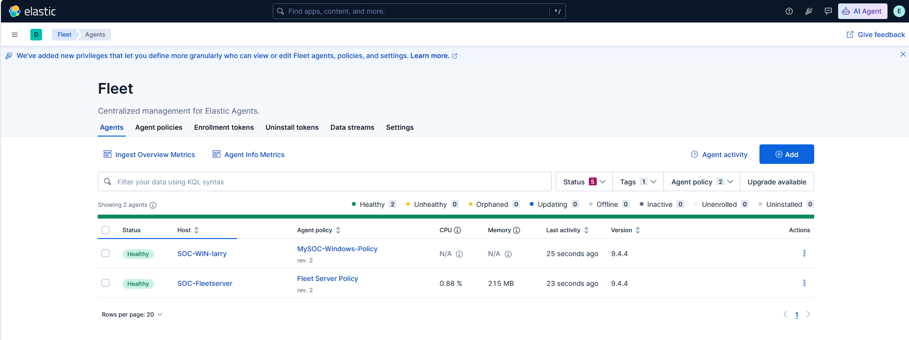

# Week 1 — Daily Log

## Day 1

**Goal for today:**
- Set up the base system and get Elasticsearch and Kibana installed and running

**What I did:**
1. Updated the system:
   ```bash
   apt-get update && apt-get upgrade -y
   ```
2. Downloaded and installed Elasticsearch via `dpkg`:
   ```bash
   wget https://artifacts.elastic.co/downloads/elasticsearch/elasticsearch-9.4.4-amd64.deb
   dpkg -i elasticsearch-9.4.4-amd64.deb
   ```
3. Edited the Elasticsearch config:
   ```bash
   cd /etc/elasticsearch/
   vim elasticsearch.yml
   ```
   Done to set the network binding so Elasticsearch would be reachable from outside `localhost`, rather than only accepting local connections. Checked network interfaces along the way with `ip a` to confirm the correct address to bind to.
4. Enabled and started Elasticsearch:
   ```bash
   systemctl daemon-reload
   systemctl enable elasticsearch.service
   systemctl start elasticsearch.service
   systemctl status elasticsearch.service
   ```

**Problems hit / next steps:**
- Elasticsearch installation and startup went cleanly — Kibana setup carried into day 2 below.

---

## Day 2

**Goal for today:**
- Get Kibana running and connected to Elasticsearch

**What I did:**
1. Downloaded and installed Kibana via `dpkg`:
   ```bash
   wget https://artifacts.elastic.co/downloads/kibana/kibana-9.4.4-amd64.deb
   dpkg -i kibana-9.4.4-amd64.deb
   ```
2. Edited the Kibana config:
   ```bash
   vim /etc/kibana/kibana.yml
   ```
   Done to set the network binding so Kibana would accept connections from outside `localhost` instead of only the loopback interface.
3. Enabled and started Kibana:
   ```bash
   systemctl daemon-reload
   systemctl enable kibana.service
   systemctl start kibana.service
   systemctl status kibana.service
   ```
4. Generated a Kibana enrollment token using `elasticsearch-create-enrollment-token --scope kibana` — needed so Kibana can securely connect to and authenticate with Elasticsearch, since security features (TLS, authentication) are enabled by default
5. Generated the encryption keys needed for the keystore:
   ```bash
   ./kibana-encryption-keys generate
   ```
6. Added those keys to the Kibana keystore:
   ```bash
   ./kibana-keystore add xpack.encryptedSavedObjects.encryptionKey
   ./kibana-keystore add xpack.reporting.encryptionKey
   ./kibana-keystore add xpack.security.encryptionKey
   ```
   Needed for Kibana to encrypt saved objects, reports, and session/security data at rest.
7. Restarted Kibana to apply the new keystore values
8. Edited `/etc/kibana/kibana.yml` again to diagnose why Kibana kept crashing on startup
9. Checked service status for both Kibana and Elasticsearch
10. Pulled detailed logs with `journalctl` to find the real error
11. Confirmed listening ports with `ss -tlnp | grep 5601`
12. Checked network interfaces with `ip a`
13. Reviewed `/etc/elasticsearch/elasticsearch.yml` to confirm its network settings matched what Kibana needed
14. Added a UFW rule to allow port 5601, so the host firewall wouldn't block browser access
15. Verified firewall status with `ufw status verbose`
16. Tested connectivity with `curl -v` against both `localhost` and the VM's actual address
17. Restarted Kibana again after the config fix


**Problems hit:**
- Kibana kept crash-looping (`Active: failed`, `Start request repeated too quickly`)
- `journalctl` revealed the real error: `FATAL Error: listen EADDRNOTAVAIL` — Kibana's `server.host` in `kibana.yml` was set to an IP that didn't match the VM's actual assigned IP
- After fixing that, `curl localhost:5601` still failed with "connection refused" — because Kibana was bound to the specific host IP, not `0.0.0.0`, so loopback wasn't listening
- Cloud firewall's inbound Accept rule was scoped to a private LAN IP instead of my actual public IP, so remote browser access timed out even though Kibana and UFW were both fine

**How I solved them:**
- Set `server.host: 0.0.0.0` in `kibana.yml` so Kibana listens on all interfaces instead of one static IP — confirmed via `ss -tlnp` showing `0.0.0.0:5601`
- Corrected the cloud firewall's Accept rule source to my actual public IP with a `/32` mask
- After both fixes, `curl` against the VM's address returned a full HTTP 200 response with the Kibana HTML page

**Still open / next steps:**
- Complete Kibana's interactive setup flow (enrollment code) in the browser
- Confirm Elasticsearch connection is fully validated inside Kibana's setup screen
- Move on to ingesting Sysmon logs
---

## Day 3

**Goal for today:**
- Set up Fleet Server and enroll a Windows host into Fleet

**Context — what Fleet Server does:**
Fleet Server acts as the central management point between Elastic Agents and Elasticsearch/Kibana. Instead of configuring and updating every agent individually, agents check in with Fleet Server to receive their policies, configuration changes, and integration updates, and Fleet Server relays their data and health status back to Kibana. This makes it possible to manage many endpoints (like this Windows host) from a single place, rather than touching each machine by hand.

**What I did:**
1. Installed Elastic Agent as a Fleet Server on the centralized Linux host using the install command generated by Kibana's "Add Fleet Server" flow, pointing it at Elasticsearch (`--fleet-server-es`), the service token, the enrollment policy, and the CA trusted fingerprint.
2. Added an inbound firewall rule on the VPC for the Fleet Server's public IP, scoped to `TCP/8220`, restricted to `64.177.122.71/32` (single host, not a subnet) rather than a wider CIDR range.
3. First enrollment attempt failed:
```
   Error: fleet-server failed: timed out waiting for Fleet Server to start after 2m0s
```
   Investigated by checking connectivity to Elasticsearch and confirming the correct architecture build (`uname -m`) was used, since the installer defaults to aarch64 downloads on some pages.
4. Downloaded the Windows x86_64 Elastic Agent build and attempted enrollment:
```powershell
   .\elastic-agent.exe install --url=https://64.177.122.71:8220 --enrollment-token=<token>
```
5. Hit `Error: already installed at: C:\Program Files\Elastic\Agent` — an older agent install was already present, so a clean uninstall was required before reinstalling.
6. Uninstall initially failed when run from the extracted install folder:
```
   Error: can only be uninstalled by executing the installed Elastic Agent at: C:\...
```
   Fixed by running the uninstall from the actual installed path, quoted because of the space in `Program Files`:
```powershell
   & "C:\Program Files\Elastic\Agent\elastic-agent.exe" uninstall
```
7. Re-ran the install command from the extracted folder, successfully enrolling the Windows host into Fleet.
8. Verified persistence of the Elastic Agent service so it survives reboots:
```powershell
   Get-Service "Elastic Agent" | Select-Object Name, Status, StartType
```
9. Noticed the enrolled host displayed as `Guest` in Fleet instead of a meaningful hostname, and renamed the Windows machine:
```powershell
   Rename-Computer -NewName "SOC-WIN-larry" -Restart
```



**Problems hit:**
- Fleet Server timed out waiting to start on first attempt — likely a networking/reachability issue to Elasticsearch, or an architecture mismatch in the downloaded binary
- Windows enrollment initially pointed at the wrong port (443 instead of Fleet Server's actual listening port, 8220)
- Uninstall/reinstall was blocked because Elastic Agent enforces that uninstall must be run from its actual installed path, not the extracted install directory
- Enrolled Windows host showed up in Fleet as `Guest` rather than its intended name

**How I solved them:**
- Confirmed system architecture with `uname -m` and matched the correct Elastic Agent build
- Corrected the Fleet Server URL to use port `8220` for Windows enrollment
- Ran uninstall directly from `C:\Program Files\Elastic\Agent\elastic-agent.exe`, quoting the path due to the space in `Program Files`
- Renamed the Windows host to `SOC-WIN-larry` via `Rename-Computer -Restart` to correct the displayed hostname in Fleet

**Still open / next steps:**
- Confirm Fleet now displays the updated hostname `SOC-WIN-larry` after reboot, and unenroll/re-enroll if the name doesn't refresh automatically
- Verify Windows host is actively shipping logs/data into Elasticsearch via Fleet
- Begin mapping Windows event/Sysmon data ingestion once the host is confirmed healthy in Fleet
