# Week 1 — Daily Log

## Day 1

**Goal for today:**
- Set up the base system and get Elasticsearch and Kibana installed and running

**What I did:**
1. Updated the system:
   ```bash
   apt-get update && apt-get upgrade -y
   ```
2. Downloaded and installed Elasticsearch via `dpkg`:
   ```bash
   wget https://artifacts.elastic.co/downloads/elasticsearch/elasticsearch-9.4.4-amd64.deb
   dpkg -i elasticsearch-9.4.4-amd64.deb
   ```
3. Edited the Elasticsearch config:
   ```bash
   cd /etc/elasticsearch/
   vim elasticsearch.yml
   ```
   Done to set the network binding so Elasticsearch would be reachable from outside `localhost`, rather than only accepting local connections. Checked network interfaces along the way with `ip a` to confirm the correct address to bind to.
4. Enabled and started Elasticsearch:
   ```bash
   systemctl daemon-reload
   systemctl enable elasticsearch.service
   systemctl start elasticsearch.service
   systemctl status elasticsearch.service
   ```

**Problems hit / next steps:**
- Elasticsearch installation and startup went cleanly — Kibana setup carried into day 2 below.

---

## Day 2

**Goal for today:**
- Get Kibana running and connected to Elasticsearch

**What I did:**
1. Downloaded and installed Kibana via `dpkg`:
   ```bash
   wget https://artifacts.elastic.co/downloads/kibana/kibana-9.4.4-amd64.deb
   dpkg -i kibana-9.4.4-amd64.deb
   ```
2. Edited the Kibana config:
   ```bash
   vim /etc/kibana/kibana.yml
   ```
   Done to set the network binding so Kibana would accept connections from outside `localhost` instead of only the loopback interface.
3. Enabled and started Kibana:
   ```bash
   systemctl daemon-reload
   systemctl enable kibana.service
   systemctl start kibana.service
   systemctl status kibana.service
   ```
4. Generated a Kibana enrollment token using `elasticsearch-create-enrollment-token --scope kibana` — needed so Kibana can securely connect to and authenticate with Elasticsearch, since security features (TLS, authentication) are enabled by default
5. Generated the encryption keys needed for the keystore:
   ```bash
   ./kibana-encryption-keys generate
   ```
6. Added those keys to the Kibana keystore:
   ```bash
   ./kibana-keystore add xpack.encryptedSavedObjects.encryptionKey
   ./kibana-keystore add xpack.reporting.encryptionKey
   ./kibana-keystore add xpack.security.encryptionKey
   ```
   Needed for Kibana to encrypt saved objects, reports, and session/security data at rest.
7. Restarted Kibana to apply the new keystore values
8. Edited `/etc/kibana/kibana.yml` again to diagnose why Kibana kept crashing on startup
9. Checked service status for both Kibana and Elasticsearch
10. Pulled detailed logs with `journalctl` to find the real error
11. Confirmed listening ports with `ss -tlnp | grep 5601`
12. Checked network interfaces with `ip a`
13. Reviewed `/etc/elasticsearch/elasticsearch.yml` to confirm its network settings matched what Kibana needed
14. Added a UFW rule to allow port 5601, so the host firewall wouldn't block browser access
15. Verified firewall status with `ufw status verbose`
16. Tested connectivity with `curl -v` against both `localhost` and the VM's actual address
17. Restarted Kibana again after the config fix


**Problems hit:**
- Kibana kept crash-looping (`Active: failed`, `Start request repeated too quickly`)
- `journalctl` revealed the real error: `FATAL Error: listen EADDRNOTAVAIL` — Kibana's `server.host` in `kibana.yml` was set to an IP that didn't match the VM's actual assigned IP
- After fixing that, `curl localhost:5601` still failed with "connection refused" — because Kibana was bound to the specific host IP, not `0.0.0.0`, so loopback wasn't listening
- Cloud firewall's inbound Accept rule was scoped to a private LAN IP instead of my actual public IP, so remote browser access timed out even though Kibana and UFW were both fine

**How I solved them:**
- Set `server.host: 0.0.0.0` in `kibana.yml` so Kibana listens on all interfaces instead of one static IP — confirmed via `ss -tlnp` showing `0.0.0.0:5601`
- Corrected the cloud firewall's Accept rule source to my actual public IP with a `/32` mask
- After both fixes, `curl` against the VM's address returned a full HTTP 200 response with the Kibana HTML page

**Still open / next steps:**
- Complete Kibana's interactive setup flow (enrollment code) in the browser
- Confirm Elasticsearch connection is fully validated inside Kibana's setup screen
- Move on to ingesting Sysmon logs
---

## Day 3

**Goal for today:**
- Set up Fleet Server and enroll a Windows host into Fleet

**Context — what Fleet Server does:**
Fleet Server acts as the central management point between Elastic Agents and Elasticsearch/Kibana. Instead of configuring and updating every agent individually, agents check in with Fleet Server to receive their policies, configuration changes, and integration updates, and Fleet Server relays their data and health status back to Kibana. This makes it possible to manage many endpoints (like this Windows host) from a single place, rather than touching each machine by hand.

**What I did:**
1. Installed Elastic Agent as a Fleet Server on the centralized Linux host using the install command generated by Kibana's "Add Fleet Server" flow, pointing it at Elasticsearch (`--fleet-server-es`), the service token, the enrollment policy, and the CA trusted fingerprint.
2. Added an inbound firewall rule on the VPC for the Fleet Server's public IP, scoped to `TCP/8220`, restricted to `64.177.122.71/32` (single host, not a subnet) rather than a wider CIDR range.
3. First enrollment attempt failed:
```
   Error: fleet-server failed: timed out waiting for Fleet Server to start after 2m0s
```
   Investigated by checking connectivity to Elasticsearch and confirming the correct architecture build (`uname -m`) was used, since the installer defaults to aarch64 downloads on some pages.
4. Downloaded the Windows x86_64 Elastic Agent build and attempted enrollment:
```powershell
   .\elastic-agent.exe install --url=https://64.177.122.71:8220 --enrollment-token=<token>
```
5. Hit `Error: already installed at: C:\Program Files\Elastic\Agent` — an older agent install was already present, so a clean uninstall was required before reinstalling.
6. Uninstall initially failed when run from the extracted install folder:
```
   Error: can only be uninstalled by executing the installed Elastic Agent at: C:\...
```
   Fixed by running the uninstall from the actual installed path, quoted because of the space in `Program Files`:
```powershell
   & "C:\Program Files\Elastic\Agent\elastic-agent.exe" uninstall
```
7. Re-ran the install command from the extracted folder, successfully enrolling the Windows host into Fleet.
8. Verified persistence of the Elastic Agent service so it survives reboots:
```powershell
   Get-Service "Elastic Agent" | Select-Object Name, Status, StartType
```
9. Noticed the enrolled host displayed as `Guest` in Fleet instead of a meaningful hostname, and renamed the Windows machine:
```powershell
   Rename-Computer -NewName "SOC-WIN-larry" -Restart
```


**Problems hit:**
- Fleet Server timed out waiting to start on first attempt — likely a networking/reachability issue to Elasticsearch, or an architecture mismatch in the downloaded binary
- Windows enrollment initially pointed at the wrong port (443 instead of Fleet Server's actual listening port, 8220)
- Uninstall/reinstall was blocked because Elastic Agent enforces that uninstall must be run from its actual installed path, not the extracted install directory
- Enrolled Windows host showed up in Fleet as `Guest` rather than its intended name

**How I solved them:**
- Confirmed system architecture with `uname -m` and matched the correct Elastic Agent build
- Corrected the Fleet Server URL to use port `8220` for Windows enrollment
- Ran uninstall directly from `C:\Program Files\Elastic\Agent\elastic-agent.exe`, quoting the path due to the space in `Program Files`
- Renamed the Windows host to `SOC-WIN-larry` via `Rename-Computer -Restart` to correct the displayed hostname in Fleet

**Still open / next steps:**
- Confirm Fleet now displays the updated hostname `SOC-WIN-larry` after reboot, and unenroll/re-enroll if the name doesn't refresh automatically
- Verify Windows host is actively shipping logs/data into Elasticsearch via Fleet
- Begin mapping Windows event/Sysmon data ingestion once the host is confirmed healthy in Fleet
---

## Day 4

**Goal for today:**
- Install Sysmon on the Windows host to enable detailed process/network/registry event logging for ingestion into Elastic

**What I did:**
1. Downloaded Sysmon from the official Sysinternals page:
   https://learn.microsoft.com/en-us/sysinternals/downloads/sysmon
2. Downloaded a community-maintained Sysmon configuration file (`sysmonconfig.xml`) from Olaf Hartong's `sysmon-modular` repo, which provides a much more comprehensive event-filtering ruleset than Sysmon's bare defaults:
   https://github.com/olafhartong/sysmon-modular

   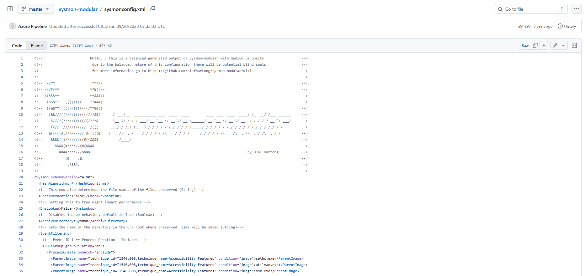

3. Extracted the Sysmon download into `C:\Users\Administrator\Downloads\Sysmon`, confirmed contents:
```powershell
   dir
```
   Files present: `Eula.txt`, `Sysmon.exe`, `Sysmon64.exe`, `Sysmon64a.exe`, `sysmonconfig.xml`
4. Installed Sysmon using the downloaded config file, from an elevated PowerShell:
```powershell
   .\Sysmon64.exe -i sysmonconfig.xml
```
5. Confirmed successful install/start from the command output:
```
   Loading configuration file with schema version 4.90
   Sysmon schema version: 4.91
   Configuration file validated.
   Sysmon64 installed.
   SysmonDrv installed.
   Starting SysmonDrv.
   SysmonDrv started.
   Starting Sysmon64..
   Sysmon64 started.
```
6. Verified Sysmon was actively generating events by checking Event Viewer:
   `Applications and Services Logs → Microsoft → Windows → Sysmon → Operational`

   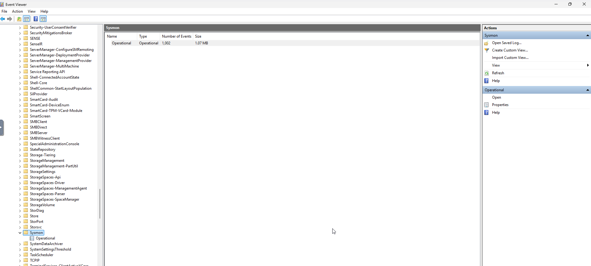

**Still open / next steps:**
- Confirm Elastic Agent's Windows/Sysmon integration is picking up and shipping these events into Elasticsearch
- Validate Sysmon events are visible/searchable in Kibana, then revisit the Sysmon App for Splunk exercises as a comparison point between the two SIEM stacks
## Day 5

**Goal for today:**
- Ingest Windows Sysmon logs into Elastic via the Custom Windows Event Logs integration, and add Microsoft Defender event collection through the same integration

**What I did:**
1. In Kibana, navigated to **Integrations → Add integration** and added the **Custom Windows Event Logs** integration to the agent policy for `SOC-WIN-larry`

   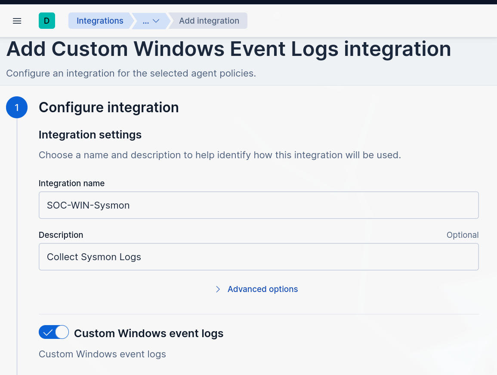

2. Selected **Logs** as the data stream type for the policy (as opposed to Metrics or Traces)
3. Left the log channel name at its default for Sysmon, so events were pulled from the standard Sysmon Operational log
4. Configured the integration's advanced settings:
   - **Event ID**: comma-separated list of included/excluded event IDs (accepts single IDs like `4624`, ranges like `4700-4800`, or exclusions like `-4735`)
   - **Ignore events older than**: `72h`, so the agent skips backfilling anything older than 3 days
   - **Language ID**: left at `0` (system default / en-US)
5. Added a second instance of the **Custom Windows Event Logs** integration (same policy), again leaving the log channel name at its default — this time for Microsoft Defender — and set the specific Defender event IDs I wanted collected: `1116, 1117, 5001`
   - `1116` — Defender detected malware
   - `1117` — Defender took action on a threat
   - `5001` — Real-time protection was disabled

   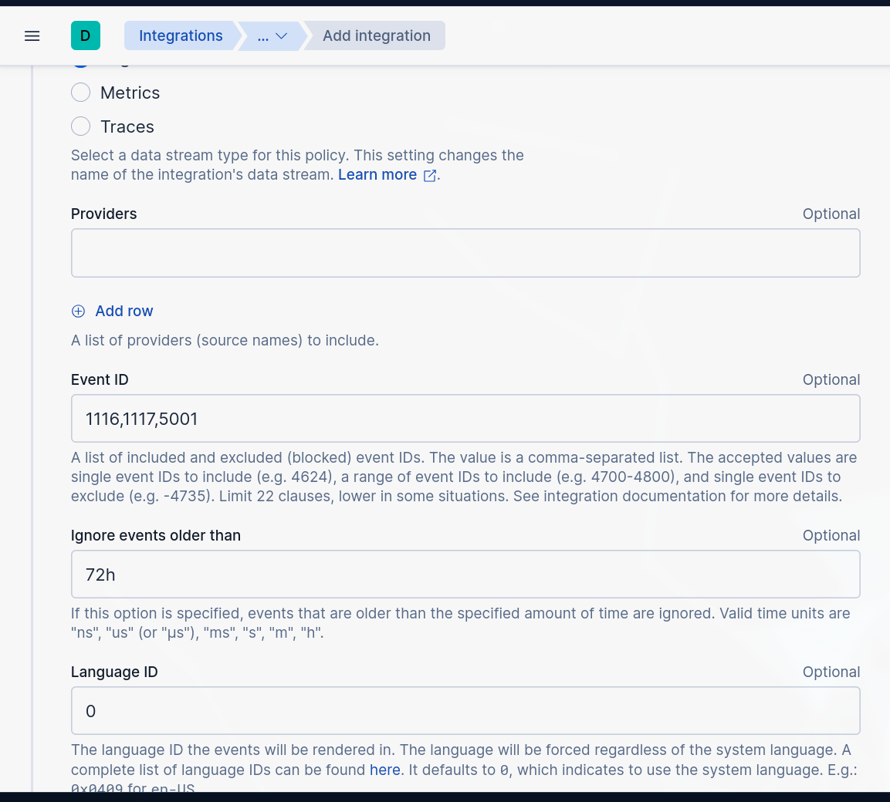

6. Saved and deployed the updated policy so Elastic Agent on the Windows host picked up both log sources
7. Confirmed the agent applied the new policy:
```powershell
   Get-Service "Elastic Agent" | Select-Object Name, Status, StartType
```
8. Verified Sysmon and Defender events were both flowing into Elasticsearch by checking **Discover** in Kibana, filtered to each respective data stream

**Still open / next steps:**
- Build a Kibana dashboard combining Sysmon and Defender data for the Windows host
- Compare Defender's native alerting (event IDs 1116/1117) against raw Sysmon events for the same malicious activity
- Tune the Event ID filter lists further if noise becomes an issue
## Day 6

**Goal for today:**
- Enroll a second Linux host (`SOC-Linux-larry`) into Fleet as a standard agent, to broaden log collection beyond the Windows endpoint

**What I did:**
1. Confirmed system architecture before downloading the agent:
   ```bash
   uname -m
   ```
   Returned `x86_64`, confirming the correct Elastic Agent build to download in Kibana's "Add agent" flow
2. Downloaded, extracted, and attempted to install/enroll the agent:
   ```bash
   curl -L -O https://artifacts.elastic.co/downloads/beats/elastic-agent/elastic-agent-9.4.4-linux-x86_64.tar.gz
   tar xzvf elastic-agent-9.4.4-linux-x86_64.tar.gz
   cd elastic-agent-9.4.4-linux-x86_64
   sudo ./elastic-agent install --url=https://64.177.122.71:8220 --enrollment-token=<token>
   ```
3. First enrollment attempt failed and retried repeatedly with:
   ```
   Error detected: fail to execute request to fleet-server: x509: certificate signed by unknown authority, will retry in a moment.
   ```
4. Suspended the stuck process with `Ctrl+Z` to investigate — this only suspends the job rather than killing it
5. Re-ran the install with `--insecure` to bypass TLS verification against Fleet Server's self-signed cert:
   ```bash
   sudo ./elastic-agent install --url=https://64.177.122.71:8220 --enrollment-token=<token> --insecure
   ```
6. Hit `Error: already installed at: /opt/Elastic/Agent` — the suspended job from step 4 had already completed the install in the background
7. Cleared the stuck job and cleanly reinstalled:
   ```bash
   jobs
   kill -9 %1
   sudo /opt/Elastic/Agent/elastic-agent uninstall
   sudo ./elastic-agent install --url=https://64.177.122.71:8220 --enrollment-token=<token> --insecure
   ```
8. Agent enrolled successfully into Fleet:

   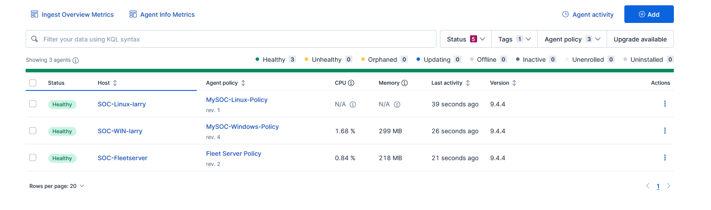

9. Agent showed **Degraded** health after enrolling:
   ```
   Recoverable: Elasticsearch request failed: dial tcp 216.128.156.245:9200: i/o timeout
   ```
10. Ruled out UFW as the cause — confirmed port 9200 already allowed inbound from anywhere on the Elasticsearch host:
    ```bash
    sudo ufw status verbose
    ```
11. Checked the Vultr cloud firewall group on the Elasticsearch host and found only three IPs allowed (each scoped `/32`) — none matched the Linux agent's own public IP
12. Identified the Linux agent's public IP:
    ```bash
    curl ifconfig.me
    ```
    Returned `66.42.117.183` — not present in the Elasticsearch host's firewall group
13. Added an Accept rule for `66.42.117.183/32` on TCP/9200 to the Elasticsearch host's Vultr firewall group
14. Re-tested connectivity from the agent:
    ```bash
    curl -v -k https://216.128.156.245:9200
    ```
    Result: full TLS handshake succeeded against the self-signed `SOC-ELK` cert, and Elasticsearch responded with `HTTP/1.1 401 Unauthorized` — confirming the network path was open (401 is expected without credentials; the important part was getting a response instead of a timeout)
15. Fleet briefly showed a transient **Unhealthy** state after the fix, but direct CLI status on the host confirmed everything was actually healthy:
    ```bash
    sudo /opt/Elastic/Agent/elastic-agent status --output=full
    ```
    All inputs and outputs (fleet, filestream-monitoring, log-default, system/metrics-default) reported `HEALTHY`
16. Refreshed the Fleet Agents page, which then correctly displayed `SOC-Linux-larry` as **Healthy**
17. Confirmed all three hosts (`SOC-ELK`, `SOC-WIN-larry`, `SOC-Linux-larry`) were actively sending logs into the Elastic stack:

    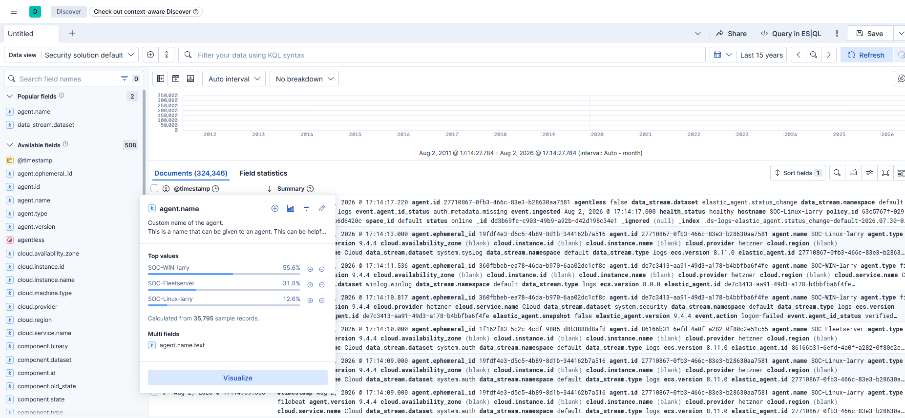

**Problems hit:**
- `x509: certificate signed by unknown authority` — Fleet Server uses a self-signed cert, which the agent doesn't trust by default
- `Ctrl+Z` suspended rather than killed the enrollment process, leaving a background install that blocked the next attempt with `Error: already installed`
- Agent enrolled but reported `Degraded`/`i/o timeout` reaching Elasticsearch on port 9200 — turned out to be the Vultr cloud firewall group missing an inbound rule for the Linux agent's specific public IP (UFW and Elasticsearch's own binding were both already correct)
- Fleet's UI briefly showed `Unhealthy` even after the fix — a stale status snapshot that cleared once the agent completed another check-in cycle

**How I solved them:**
- Used `--insecure` on the install command to bypass cert validation for this lab environment (in production, would use `--certificate-authorities` or a CA fingerprint instead, as done for the Windows Fleet Server enrollment on Day 3)
- Killed the suspended background job with `kill -9 %1`, then cleanly uninstalled via `/opt/Elastic/Agent/elastic-agent uninstall` before reinstalling
- Diagnosed the timeout methodically: ruled out UFW first (already open), then found and fixed the actual cause — the agent's own public IP (`66.42.117.183/32`) was missing from the Elasticsearch host's Vultr firewall group
- Confirmed the fix using a manual `curl` test (TLS handshake + 401 response, instead of a timeout) before trusting Fleet's own status indicator, then cross-checked with `elastic-agent status --output=full` directly on the host to bypass a temporarily stale Fleet UI reading

**Still open / next steps:**
- Decide what integrations/log sources to add for this Linux host, now that it's confirmed healthy (currently only running the base System integration)
- Consider standardizing on `--certificate-authorities`/CA fingerprint instead of `--insecure` across agents, for consistency with the Windows Fleet Server setup
- Build a Kibana dashboard incorporating this Linux host alongside the existing Windows/Sysmon/Defender data
- Look into scoping the Vultr firewall's port 9200 rule down to just port 9200 (not a full `1:65535` range) for tighter security, and consider narrowing the existing 5601 rule the same way
## Day 7

**Goal for today:**
- Build a Kibana query to detect SSH brute-force activity, turn it into an alert rule, and visualize the failed/successful attempts on a dashboard using Maps

**What I did:**
1. Went into **Discover**, selected the relevant data view, and built the initial query to isolate SSH activity:
   ```
   system.auth.ssh.event : *
   ```
   Reviewed the results — noticed a large volume of `Failed` events hitting many different usernames (`root`, `dev`, `test`, `ubuntu`, etc.) from a small handful of source IPs in short bursts, most heavily from `45.153.34.41` (Netherlands).

   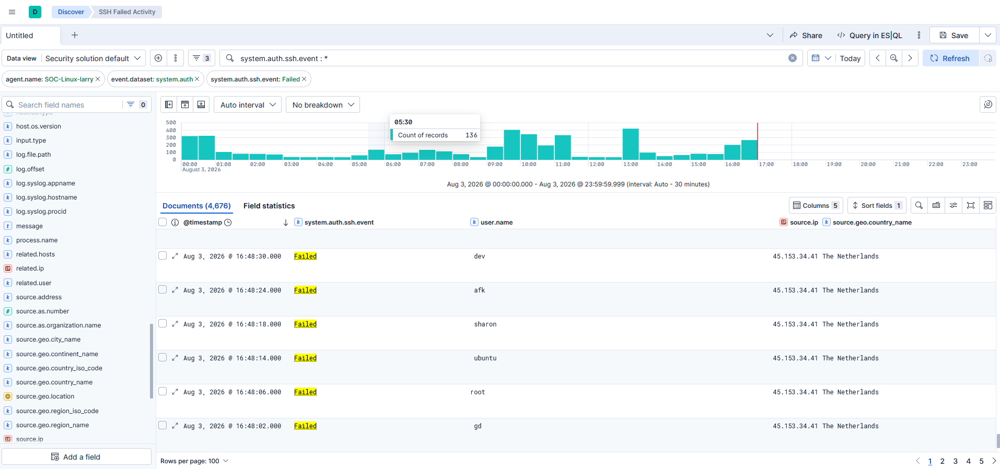

2. Narrowed the query to only failed authentications and used **Create rule → Elasticsearch query** from Discover to build an alert off of it:
   ```
   system.auth.ssh.event : "Failed"
   ```
3. Configured the rule's grouping/threshold to catch brute-force behavior instead of alerting on every single failed login:
   - **Group by**: `source.ip`
   - **Threshold**: alert when a group exceeds a set number of matching documents (tuned this against the volume seen from `45.153.34.41`)
   - **Time window**: a short rolling window (few minutes) so the rule reacts to bursts, not scattered one-off failures
   - Left **"Exclude matches from previous runs"** enabled so the same failed-login burst doesn't re-trigger the rule on every scheduled run
4. Set the **rule schedule** to check on a short interval so bursts get caught quickly without over-hammering Elasticsearch
5. Saved the rule — confirmed it correctly picked out the `45.153.34.41` brute-force pattern rather than firing on isolated failed logins

   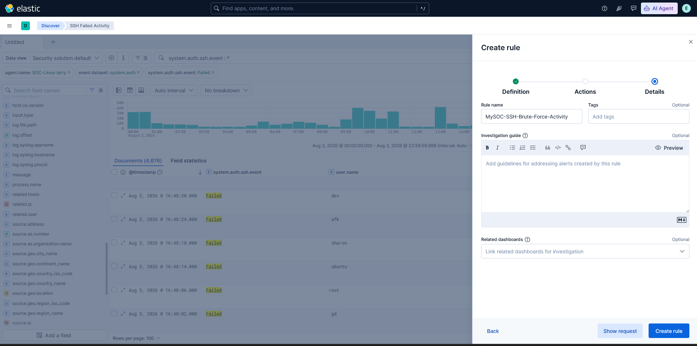

6. Built a **dashboard** with two Maps panels side by side — one for **SSH Failed Authentications** and one for **SSH Success** — each showing a choropleth of attempt volume by country (`source.geo.country_iso_code`), with a shared `source.geo.country_iso_code: US` filter applied at the dashboard level

   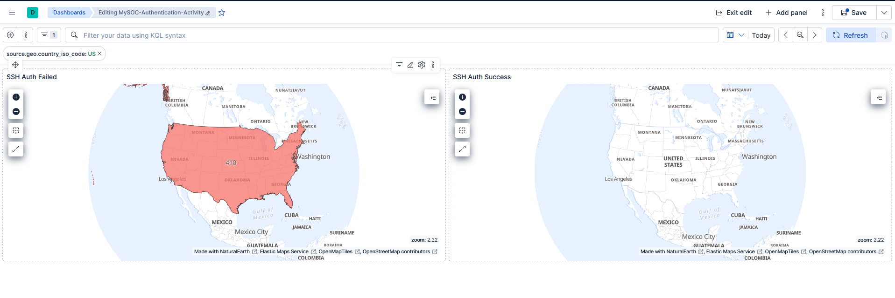

7. Used the brute-force query data to populate the map layer and confirm the geographic spread of the attack traffic

   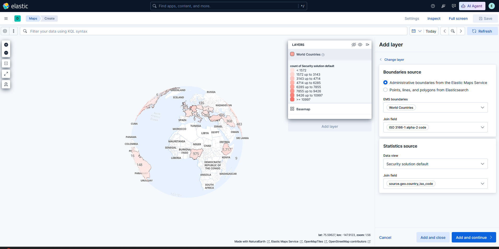

**Problems hit:**
- Initially couldn't edit the query on the second map panel (SSH Success) — turned out both panels were pointing at the same underlying saved Maps object rather than two independent visualizations, so editing one affected both
- Had to be careful that the panel-level query (`Failed` vs `Accepted`/success value) was actually being set on the correct, independent saved object rather than a shared one

**How I solved them:**
- Went into the Maps editor for the linked panel and saved it as a new, separate visualization (rather than saving back to the shared object), then re-pointed the dashboard panel at the new one
- Set the layer query explicitly per map afterward: `system.auth.ssh.event : "Failed"` on one, the success equivalent on the other, so each panel now reflects independent data

**Still open / next steps:**
- Confirm the alert rule fires correctly against live traffic (not just backtested against existing documents) and wire up an action (e.g. webhook/email) so the alert actually notifies someone
- Tune the threshold/time window further if false positives or missed bursts show up over the next few days
- Consider adding a `user.name` grouping in addition to `source.ip` to catch spray-style attacks that rotate IPs but reuse a small set of usernames
## Day 8

**Goal for today:**
- Build a query to detect failed RDP logon attempts on Windows, turn it into an alert rule, and (if time allows) visualize the failed/successful attempts on a dashboard

**Relevant Windows event:**
- **Event ID 4625** — An account failed to log on
- **Logon Type 10** — RemoteInteractive (RDP)

**What I did:**

1. **Set up an RDP client to generate test traffic**
   - Installed FreeRDP on Omarchy: `sudo pacman -S freerdp`
   - Package installs as `xfreerdp3` (not `xfreerdp` — FreeRDP 3.x uses versioned binary names). Symlinked it for convenience: `sudo ln -s /usr/bin/xfreerdp3 /usr/bin/xfreerdp`
   - Connected to the Windows target to generate failed logon attempts:
     ```
     xfreerdp3 /v:<target-ip> /u:<username> /p:<password> /cert:ignore
     ```
   - If the connection doesn't complete cleanly, force security mode explicitly with `/sec:nla` or `/sec:rdp`.

2. **Explored the alert rule build in Kibana → Stack Management → Rules**
   - Used the **Custom Threshold** rule type (`observability.rules.custom_threshold`) as a reference, based on the existing SSH bruteforce rule structure:
     - Data view: needs to point at the index actually containing the Windows RDP logs (double-check this isn't left on a default)
     - Query filter (SSH reference pulled for format):
       ```
       system.auth.ssh.event: * and agent.name: "SOC-Linux-larry" and system.auth.ssh.event: "Failed"
       ```
     - RDP equivalent to adapt:
       ```
       event.code: "4625" and winlog.logon.type: 10 and agent.name: "<windows-hostname>"
       ```
     - Still need to fill in: Aggregation A (e.g. Count), Equation and threshold (e.g. `A > 5`), Group alerts by `source.ip`, rule schedule interval, alert delay (consecutive matches)

3. **Planned the Kibana dashboard for RDP failed attempts**
   - Panels planned in Lens:
     - Failed logons over time (date histogram on `@timestamp`, filtered to `event.code:4625 and winlog.logon.type:10`)
     - Top source IPs (breakdown by `source.ip`)
     - Top targeted usernames (breakdown by `user.name`)
     - Failed vs. successful RDP comparison (`event.code:4625` vs `event.code:4624 and winlog.logon.type:10`)
   - Map layer (same approach as Day 7's SSH map) — needs `source.geo.location` populated via GeoIP enrichment; still need to confirm this is set up for the Windows/RDP data source specifically
   - Not yet assembled into a saved dashboard

4. **Created the RDP alert rules in Stack Management → Rules**
   - Confirmed live in the Rules list (Aug 4, 2026):
     - **MySOC-RDP Bruteforce Activity** — Elasticsearch query rule type, 1 min check interval, currently active (alert bell showing)
     - **MySOC-RDP-Brute-Force-Attempt** — Custom threshold rule type, 1 min check interval, currently active
   - Both are alongside the existing **MySOC-Linux-Larry-Bruteforce-SSH** (Custom threshold) and **MySOC-SSH-Brute-Force-Activity** (Elasticsearch query) rules from Day 7 — so now have both rule types covering both SSH and RDP
   - Note: built two separate RDP rules (one Elasticsearch query, one Custom threshold) rather than just one — worth deciding later whether to keep both or consolidate

   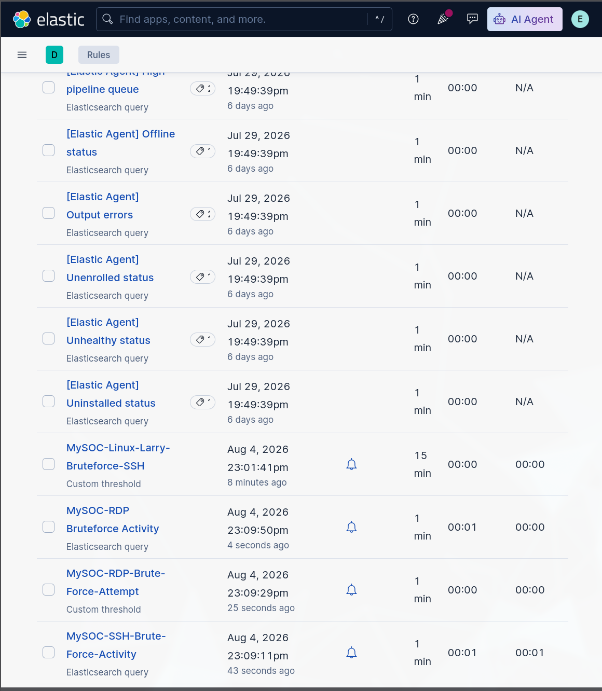

5. **Built table visualizations and added them to the dashboard**
   - Working dashboard: **MySOC-Authentication-Activity**
   - Added panel: **RDP Failed Activity [Table]**
     - Columns: `@timestamp` (per 3 hours), top 10 `source.ip`, top 10 `source.geo.country_iso_code`, top 10 `user.name`, count of records
     - Real data populating already — e.g. `173.201.45.113` and `98.187.161.247` hitting `ADMINISTRATOR`/`PUBLIC`/`Administrator` accounts, up to 12 attempts in a single 3-hour bucket
     - Confirms GeoIP enrichment **is** working for the RDP/Windows data source (country_iso_code populating correctly)
   - Added panel: **RDP Success Authentications [Table]** — currently showing **"No results found"**
   - Existing SSH table panel (filtered to `source.geo.country_iso_code: US`) still on the dashboard showing brute-force data from `146.190.154.100` and `43.130.90.166` (root/rehua/ubuntu/admin/user) — reused from Day 7

   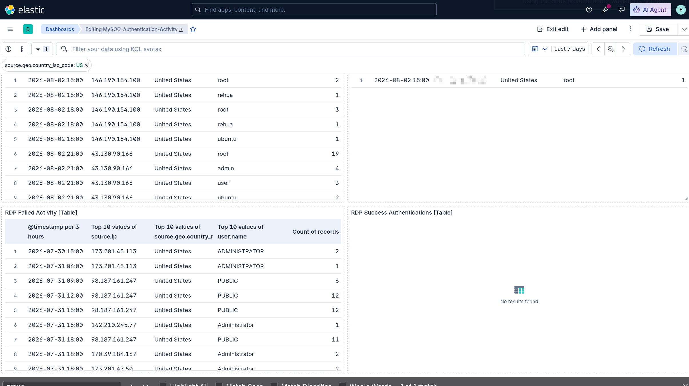

**Problems hit:**
- FreeRDP's package name (`freerdp`) doesn't match its binary name — installs as `xfreerdp3`, not `xfreerdp`, so following older guides/muscle memory for the plain `xfreerdp` command fails with `command not found`
- Ended up building two separate RDP alert rules (one Elasticsearch query, one Custom threshold) rather than a single one
- **RDP Success Authentications** table panel is returning "No results found"

**How I solved them:**
- Symlinked `xfreerdp3` to `xfreerdp` (`sudo ln -s /usr/bin/xfreerdp3 /usr/bin/xfreerdp`) for convenience going forward
- Left both RDP rules active for now rather than picking one — revisit later whether to consolidate or disable one to avoid duplicate alerting
- Not yet resolved — still need to confirm whether the empty success-auth panel is because no successful RDP test logon has been performed yet in the lab, or the query/field mapping needs adjusting

**Still open / next steps:**
- Fill in the Custom Threshold rule's Aggregation/Equation/threshold values (Count, e.g. `A > 5`) and confirm Group by `source.ip` is set
- Perform a successful RDP test logon to confirm the Success Authentications panel populates correctly
- Add the Maps panel for RDP (mirroring Day 7's SSH map) once GeoIP is confirmed fully wired up for this data source
- Wire up an action (webhook/email) on the RDP rules so they actually notify, same open item carried over from Day 7's SSH rule

## Day 9

**Goal for today:**
- Stand up a dedicated Ubuntu server for Mythic C2, get it installed via Docker Compose, and lock down access so only a trusted host can reach it

**What I did:**
1. Provisioned a fresh Ubuntu server to serve as the dedicated Mythic C2 host (kept separate from the existing Elastic stack and from the Kali attack VM, for compartmentalization)
2. Cloned the Mythic repository from GitHub:
   ```bash
   git clone https://github.com/its-a-feature/Mythic
   cd Mythic
   ```
3. Ran the provided install shell script to pull in Docker and Docker Compose dependencies:
   ```bash
   ./install_docker_ubuntu.sh
   ```
   Installed `apt-transport-https` and `gnupg-agent` as new packages; `ca-certificates`, `curl`, and `software-properties-common` were already present
4. Ran `make` in the Mythic directory to build out the project
5. Attempted to start Docker/Mythic — `docker.service` failed to start (`systemctl restart docker` → exit code 1)
6. Pulled the real error from `journalctl -xeu docker.service`:
   ```
   failed to load listeners: no sockets found via socket activation: make sure the service was started by systemd
   ```
   Caused by the default `ExecStart=... -H fd://` directive expecting `docker.socket` to hand off a listening socket via systemd socket activation, which wasn't happening cleanly
7. Started Mythic with the CLI once Docker was healthy:
   ```bash
   sudo ./mythic-cli start
   ```
8. Confirmed containers came up healthy (`mythic_server`, `mythic_react`, RabbitMQ, etc.) via `mythic-cli status` / `docker ps`
9. Created firewall rules to restrict access to the Mythic C2 from a trusted environment only, rather than leaving it open to the internet — same approach used for the Elastic stack (scoped `/32` rules rather than a broad CIDR range)
10. Reached the Mythic login page in the browser, confirming the web UI was up and serving over HTTPS

   

**Problems hit:**
- `docker.service` repeatedly failed with `Start request repeated too quickly` — root cause buried under systemd's generic wrapper messages, required `journalctl -xeu docker.service` to surface the actual `no sockets found via socket activation` error
- Mythic's web UI, RabbitMQ, and server ports were all bound to `127.0.0.1` by default (`mythic_server_bind_localhost_only` / `rabbitmq_bind_localhost_only` both true out of the box), meaning nothing outside the Mythic host itself — not even the allowlisted trusted IP — could reach them yet
- Uncertain which port the web UI actually landed on — saw `17443` in this environment rather than Mythic's documented default of `7443`

**How I solved them:**
- Diagnosed the Docker startup failure via `journalctl -xeu docker.service --no-pager -n 100` instead of relying on the truncated systemd status output
- Planned fix for the localhost-binding issue (carries into Day 10):
  ```bash
  sudo ./mythic-cli config set mythic_server_bind_localhost_only false
  sudo ./mythic-cli config set rabbitmq_bind_localhost_only false
  sudo ./mythic-cli restart
  ```
- Will re-verify the firewall rule against the correct port once Mythic is confirmed listening on `0.0.0.0`

**Still open / next steps:**
- Apply the `bind_localhost_only false` config changes and restart Mythic so it listens on all interfaces
- Confirm the actual web UI port (`7443` vs `17443`) before finalizing the firewall allowlist rule
- Test end-to-end reachability from Kali to the Mythic web UI once binding + firewall rule are both corrected

## Day 10

**Goal for today:**
- Set up Apollo agent and the HTTP C2 profile in Mythic, generate a payload, deliver it to the Windows target via RDP brute-force access, and confirm callback

**What I did:**
1. Reset the password on the Windows target machine so a brute-force login could be demonstrated against a known-good credential (password known in advance — this was a controlled demo of the brute-force path, not a blind attack)
2. Installed the **Apollo** agent into Mythic, from the Mythic Ubuntu server:
   ```bash
   ./mythic-cli install github https://github.com/MythicAgents/Apollo.git
   ```

   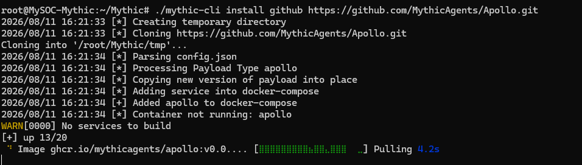

3. Installed the **HTTP** C2 profile into Mythic, same server:
   ```bash
   ./mythic-cli install github https://github.com/MythicC2Profiles/http
   ```

   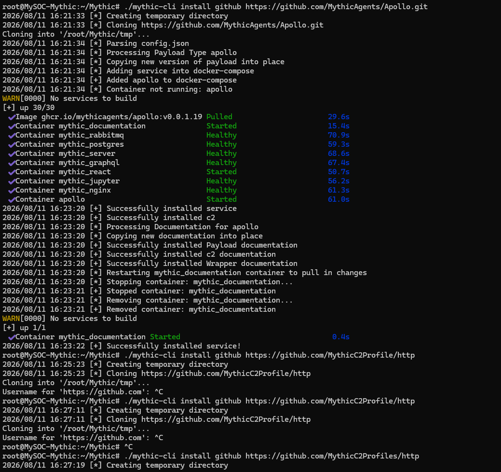

4. Confirmed Apollo and the HTTP profile were both showing as available in the Mythic UI

   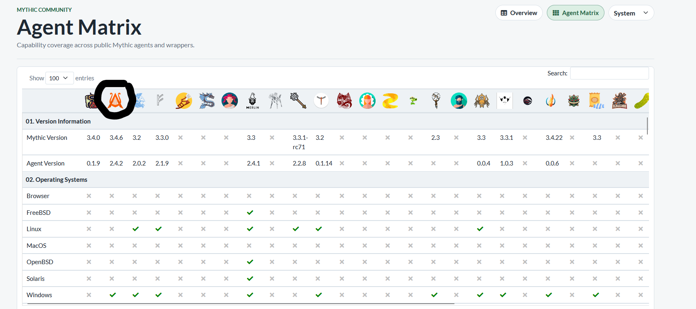

5. Created a payload in Mythic using the Apollo agent + HTTP profile

   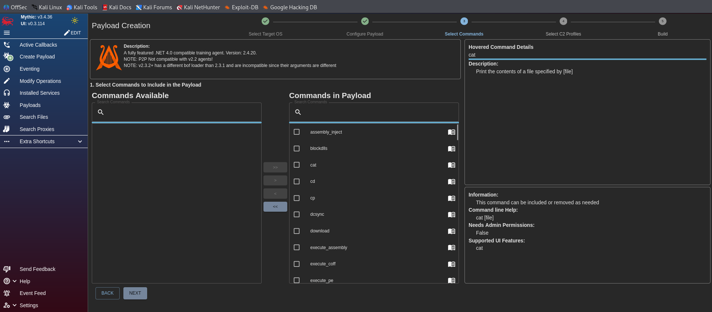

   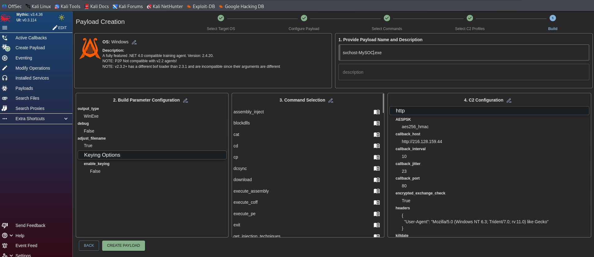

6. Moved the generated payload to the Mythic Ubuntu server and served it over a simple Python HTTP server so it could be pulled down from the Windows target
7. From the Windows machine, performed the brute-force login (using the known/reset credential from step 1) to gain access

   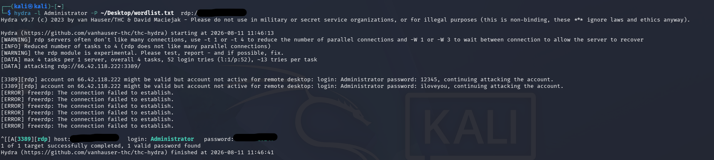

8. Downloaded and ran the payload on the Windows machine, from the Python-hosted file on the Mythic server
9. Received a callback in Mythic from the Windows host, confirming the Apollo agent checked in successfully
10. Turned off Windows Defender manually via Windows Security settings on the target (not via an agent command)

    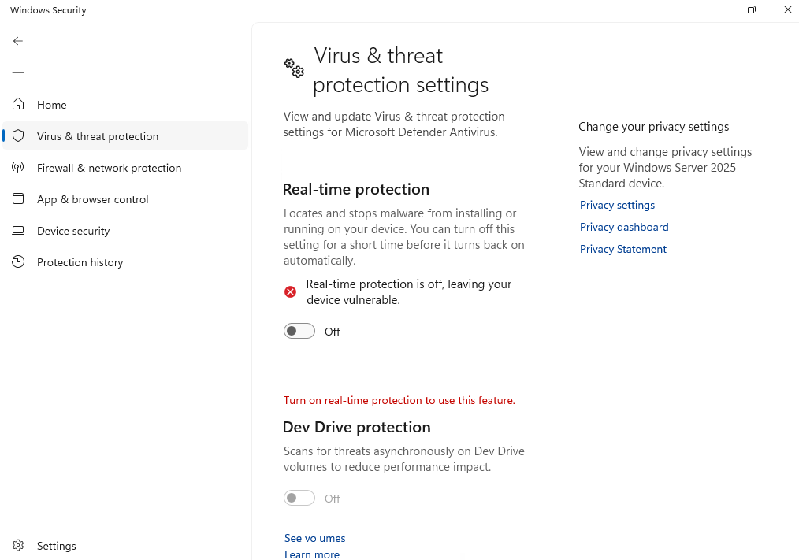

11. Created a `passwords.txt` file to represent a set of downloaded/captured credentials for the exercise

    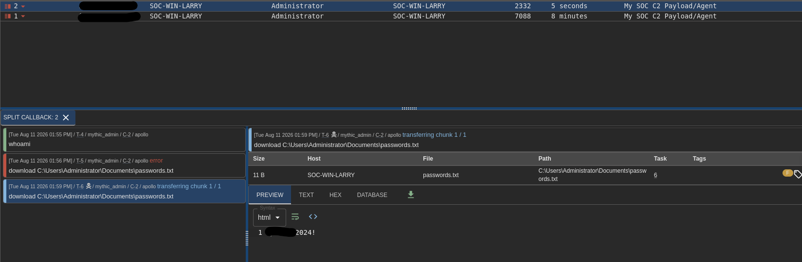

Elastic stack to see what actually got detected
- Document detection gaps: what would a blue team have seen at each step (RDP brute force → payload download → callback → Defender disabled) versus what was missed
## Day 11

**Goal for today:**
- Build a Kibana dashboard specifically for hunting/reviewing the Mythic/Apollo C2 activity from Day 10 — process creation, outbound network connections, and Defender status — to see what telemetry actually got captured across the attack chain (RDP brute force → payload download → callback → Defender disabled)

**What I did:**
1. Started in **Discover** to validate each query individually against the Windows/Sysmon data view before building any panels
2. Confirmed the actual field names available for this data source (raw `winlog.event_data.*` rather than fully ECS-mapped fields, since this comes in through the Custom Windows Event Logs integration):

   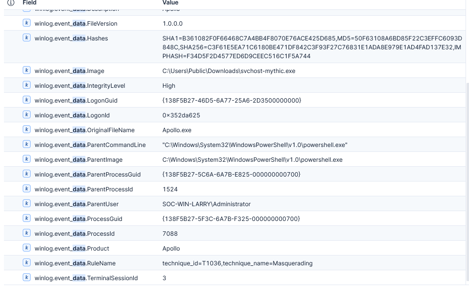

3. Built and tested the **process creation** query (Sysmon Event ID 1), scoped to the binaries relevant to the C2 exercise and common LOLBin execution:
   ```
   event.code : "1" and event.provider : "Microsoft-Windows-Sysmon" and (winlog.event_data.Image : "*powershell.exe" or winlog.event_data.Image : "*cmd.exe" or winlog.event_data.Image : "*rundll32.exe")
   ```
   Confirmed this picked up the PowerShell process that preceded `svchost-mythic.exe` execution on `SOC-WIN-larry`
4. Built and tested the **outbound network connections** query (Sysmon Event ID 3), to catch the Apollo agent's callback traffic to the Mythic C2 server:
   ```
   event.code : "3" and event.provider : "Microsoft-Windows-Sysmon" and winlog.event_data.Initiated : "true"
   ```
5. Built and tested the **Defender status** query (Event ID 5001 — real-time protection disabled), to correlate the manual Defender disablement from Day 10 with an actual logged event:
   ```
   event.code : "5001" and event.provider : "Microsoft-Windows-Windows Defender"
   ```
6. Pulled together the Apollo/C2 detection findings into a dedicated view:

   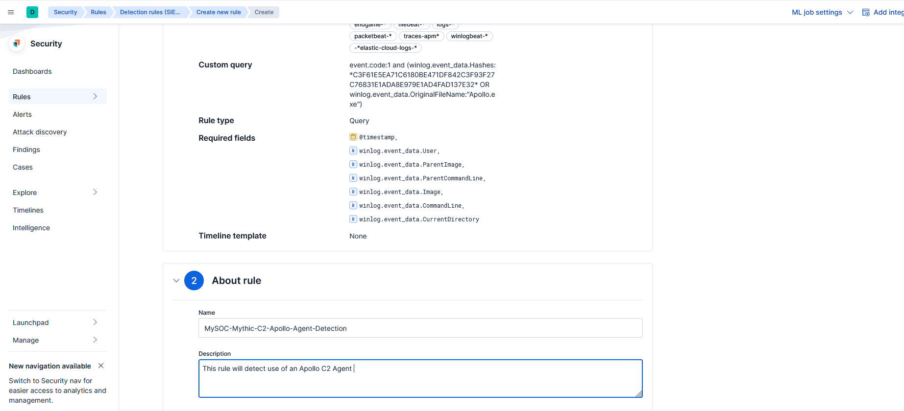

7. Created a new dashboard, **MySOC-Mythic-Activity**, combining the process-create, outbound-connection, and Defender panels into a single view for reviewing the full attack chain:

   

8. Set the dashboard's global time range to cover the Day 10 exercise window so all panels line up chronologically
9. Walked the panels in timestamp order to reconstruct the attack chain end-to-end in the telemetry: RDP brute-force success → `powershell.exe` spawning `svchost-mythic.exe` from `C:\Users\Public\Downloads\` → outbound connection from the payload to the Mythic server → Defender 5001 event around the time real-time protection was manually disabled

**Problems hit:**
- Initial process-create query returned zero results — was querying `process.name` (ECS field) instead of `winlog.event_data.Image`, since this data source isn't fully ECS-mapped
- Outbound connection panel initially showed noise from legitimate background traffic alongside the actual callback — needed to isolate by destination IP
- Had to double check field names via Discover (see `mythic_elkfields.png`) before trusting any panel results, since assuming ECS field names silently returned empty panels instead of erroring

**How I solved them:**
- Swapped ECS-style field references for the correct raw `winlog.event_data.*` field names to match this integration's actual ingest format
- Added an explicit destination IP filter to cut the outbound connections panel down to just the relevant callback traffic
## Day 12

**Goal for today:**
- Stand up osTicket on a dedicated Windows Server host using XAMPP as the web/DB stack, to bring a support-ticketing system into the SOC environment

**What I did:**
1. Downloaded the XAMPP installer (8.2.12 stack) from the official Apache Friends site:
   https://www.apachefriends.org/download.html

   Ran the installer on the Windows server, walking through the setup wizard to install Apache, MySQL, and PHP.

   

2. In the XAMPP Control Panel, edited the Apache config's properties file, changing `apache_domainname` from the default `localhost` to the server's actual IP (`64.177.15.247`), so osTicket would be reachable at the machine's real address rather than just loopback.

   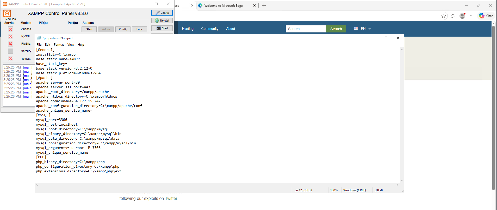

3. Added inbound Windows Firewall rules allowing TCP `80` and `443`, so remote HTTP/HTTPS traffic could actually reach the XAMPP-hosted site.

   

4. Extracted osTicket v1.18.4 into the XAMPP htdocs directory, then created a dedicated database (`mysoc-db`) in phpMyAdmin and reviewed/confirmed the `root` DB user's privileges against it.

   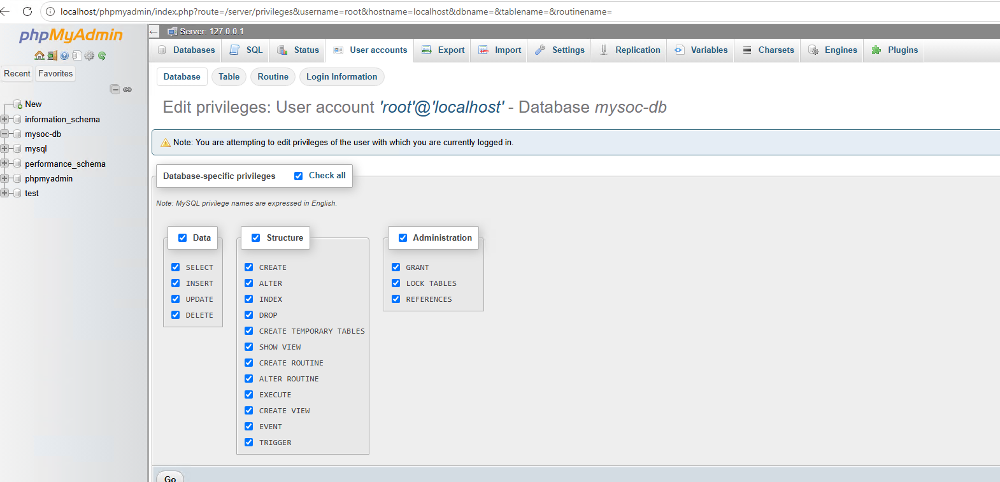

5. Browsed to the osTicket setup path — the installer's welcome page confirmed prerequisites were met (PHP 8.2.12 detected, MySQLi extension loaded).

   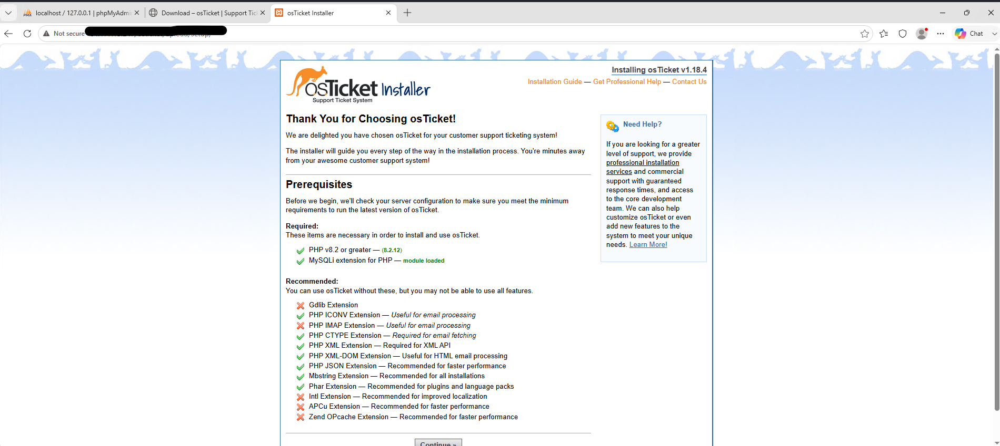

6. Hit a **"Configuration file missing!"** error — osTicket only ships a template (`include/ost-sampleconfig.php`) and expects `include/ost-config.php` to exist before setup can proceed.

   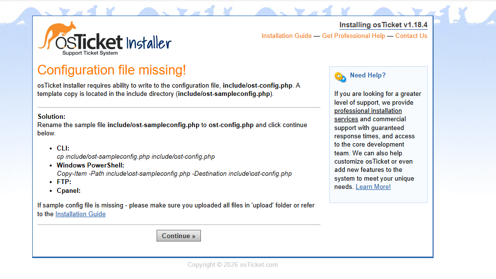

7. Resolved it per the installer's own guidance (Windows PowerShell: `Copy-Item -Path include\ost-sampleconfig.php -Destination include\ost-config.php`), then continued.
8. Reached the account setup page and filled in the admin account (name, email, username `MySOC`, password) and database settings (table prefix `ost_`, host `localhost`, database `MySOC-DB`, username `root`, password).

   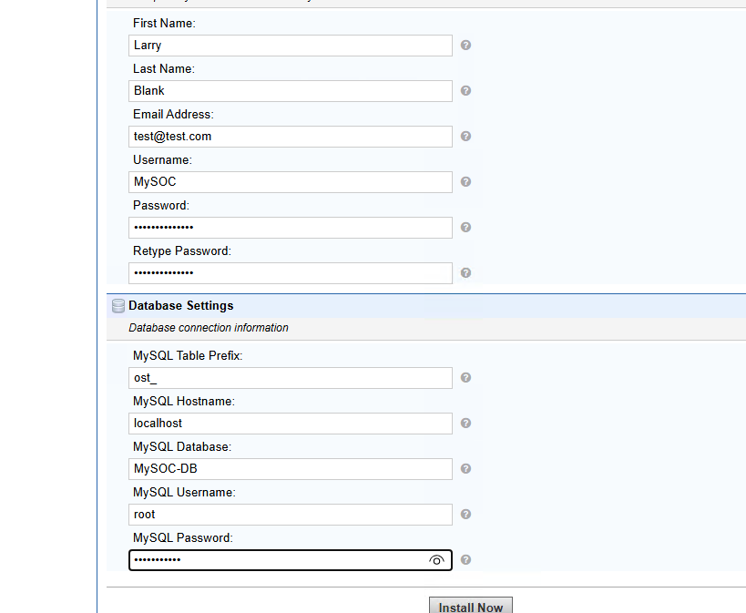

9. Clicked **Install Now** — got the **"Congratulations!"** page confirming osTicket v1.18.4 installed successfully, with the live URL (`http://64.177.15.247/osticket/upload/`) and staff control panel link.

   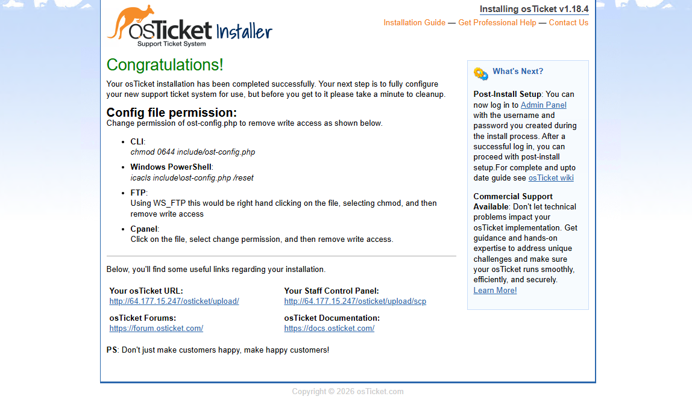

10. Per the installer's post-install cleanup instructions, locked down write access to `include/ost-config.php` from an elevated PowerShell using the Windows equivalent of `chmod`:
```powershell
    icacls .\ost-config.php /reset
```
   Confirmed with `Successfully processed 1 files; Failed processing 0 files`.

   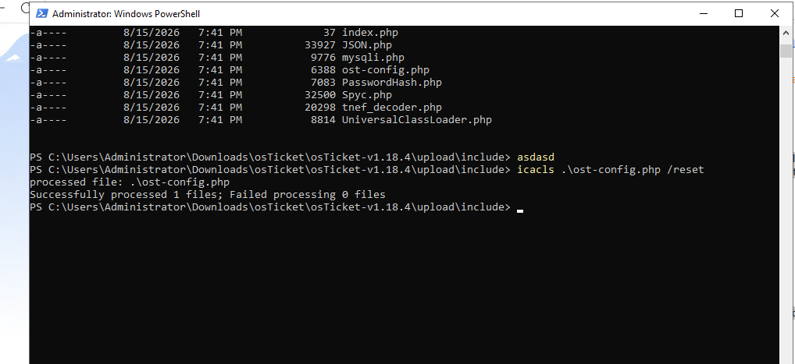

**Problems hit:**
- Setup page initially failed with "Configuration file missing!" since `ost-config.php` didn't exist yet — only the sample template did
- osTicket's post-install guidance gives different commands per platform (CLI `chmod`, PowerShell `icacls`, FTP, cPanel) — had to use the Windows-specific `icacls` syntax since this is a Windows Server host, not Linux

**How I solved them:**
- Followed osTicket's own remediation step from the "Configuration file missing" page to create `ost-config.php` from the sample
- Ran `icacls .\ost-config.php /reset` post-install to strip any leftover write permissions the installer needed during setup

**Still open / next steps:**
- Log into the Admin Panel with the created credentials and complete remaining post-install configuration
- Confirm ticket submission and staff-side workflows work end-to-end through the deployed URL
- Decide whether this Windows/XAMPP/osTicket host should be enrolled into Fleet like the other Windows endpoints, so web server/access logs feed into the Elastic stack
- Part 2 (next steps for osTicket) to follow
